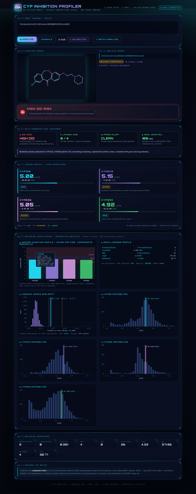

# CYP INHIBITION PROFILER

> **Research-grade in silico CYP450 direct-inhibition profiler** — a 16-model gradient-boosted ensemble trained on 4,905 dose-response curves from the [OpenADMET CYP Inhibition Blind Challenge](https://huggingface.co/datasets/openadmet/cyp-challenge-train-test), wrapped in a cyberpunk/neon Flask web UI with interactive charts, DDI risk tiering, Lipinski / PAINS / bioavailability triage, and per-CYP applicability-domain flags.



## Live demo

A public Cloudflare tunnel is usually running during development. To run locally, see [Quick start](#quick-start).

## Features

- **Direct-inhibition pIC50 predictions** for CYP1A2, CYP2C9, CYP2D6, CYP3A4
- **16-model ensemble** — XGBoost, LightGBM, Histogram-Gradient-Boost on Morgan chiral fingerprints (r=2, 2048-bit), 202 RDKit 2D descriptors, and both combined; blended with per-CYP non-negative ST-RAE-optimal weights
- **5-fold GroupKFold on Bemis-Murcko scaffolds** — no scaffold leakage; honest prospective performance
- **Interactive analytics for every molecule** (Chart.js, dark neon cyberpunk palette):
  - Isoform bar chart with liability bands (INACTIVE / WEAK / ACTIVE / POTENT) — hover for IC50, percentile, per-component model breakdown
  - Chemical-space Tanimoto similarity histogram vs all 4,905 training compounds with AD thresholds
  - Per-CYP training-distribution histograms showing the molecule's percentile in each isoform
  - Live descriptor grid with colour-coded drug-likeness
- **Overall DDI risk tier** — LOW RISK / MONITOR / HIGH DDI RISK banner with breathing pulse on high
- **Multi-parameter risk panel**:
  - Lipinski Rule-of-Five violations (MW/LogP/HBD/HBA)
  - PAINS pan-assay interference alerts (RDKit `FilterCatalog`)
  - Heuristic oral-bioavailability score (0–100)
- **Applicability domain**: nearest-training-neighbour Tanimoto (Morgan FP) with HIGH/MEDIUM/LOW confidence pill; nearest-neighbour name + SMILES
- **Mouse-reactive UI**: neon glow cursor, cross-hair, parallax grid drift, card lift-on-hover, click-to-link between CYP cards and chart bars, animated bar entry
- **Single-SMILES and batch CSV** endpoints (`/api/predict`, `/api/predict_batch`)
- **Model diagnostics dashboard** at `/diagnostics`

## Ensemble performance (5-fold scaffold CV)

| CYP | ST-RAE ↓ | R² | Spearman ρ |
|---|---|---|---|
| CYP1A2 | 0.903 | 0.26 | 0.52 |
| CYP2C9 | 0.772 | 0.37 | 0.59 |
| CYP2D6 | 0.995 | 0.15 | 0.39 |
| CYP3A4 | **0.546** | **0.59** | **0.77** |

Macro ST-RAE ≈ 0.80 (beats best single-model XGB-both macro 0.832). Lower = better; 1.0 = predicting the training mean. CYP3A4 is strongest; CYP2D6 hardest (low inter-lab consensus). See `results/baseline_summary.csv` for per-model numbers.

Submission-ready CSV (`FINAL_CYP_CHALLENGE_PREDICTIONS.csv`) covers all 750 blinded test compounds in the exact 6-column format. Only 1 of 750 falls outside the 0.3 Tanimoto AD threshold.

## Quick start

```bash
git clone https://github.com/ademmanlincoln07-crypto/cyp-inhibition-profiler.git
cd cyp-inhibition-profiler
pip install -r requirements.txt
# Place cyp-challenge-TRAIN_inhibition.csv in data/raw/ (from HuggingFace OpenADMET)
python app.py
# Open http://127.0.0.1:5000
```

First run preprocesses SMILES and caches fingerprints to `data/processed/` (~20 MB).

## API

| Endpoint | Method | What it does |
|---|---|---|
| `/api/predict` | POST `{smiles}` | Single-molecule predictions + chart data |
| `/api/predict_batch` | POST multipart CSV | Bulk predictions with DDI/AD columns |
| `/api/mol_profile` | POST `{smiles}` | Raw histogram bins + component weights for charts |
| `/diagnostics` | GET | Global model-performance dashboard |

## Research Use Notice

Predictions are **computed in silico** by a gradient-boosted ensemble. They are intended for **research, lead-optimisation and ADMET triage** — not as a substitute for experimental assays or clinical guidance. The confidence pill reflects chemical similarity to the training set, not per-prediction accuracy.

## Project structure

```
cyp-inhibition-profiler/
├── app.py                   # Flask app + cyberpunk UI + Chart.js dashboards
├── requirements.txt
├── DATASET_AUDIT_REPORT.md  # Pre-training data QA
├── screenshot.png           # Hero image for this README
├── data/raw/                # Official challenge CSVs (HuggingFace)
├── models/pipeline_artifacts.pkl   # Trained 16-model ensemble
├── results/                 # Baseline summaries, weights, blind predictions
├── figures/                 # Diagnostic figures
└── src/                     # Pipeline source (data/preprocessing/features/models/ensemble/...)
```

## Tags / Topics

`drug-discovery` `admet` `cyp450` `cytochrome-p450` `machine-learning` `cheminformatics` `rdkit` `xgboost` `lightgbm` `ddi-prediction` `pharmacokinetics` `bioavailability` `pains` `lipinski` `scaffold-cv` `cyberpunk-ui` `flask` `openadmet`

## License

MIT (see `LICENSE`). Training data © OpenADMET challenge organisers.
